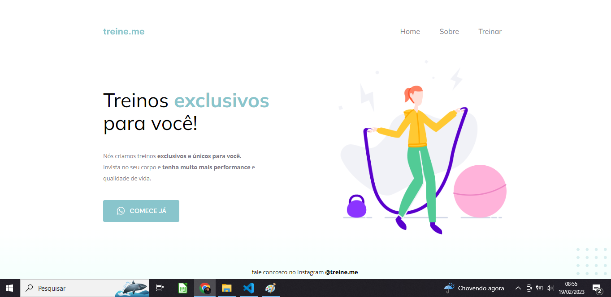

<h1 align="center"> Pagina Treine-me </h1>

Desafio Rocketseat para ensino de tecnologias WEB.

  <a href="#-tecnologias">Tecnologias</a>&nbsp;&nbsp;&nbsp;|&nbsp;&nbsp;&nbsp;
  <a href="#-projeto">Projeto</a>&nbsp;&nbsp;&nbsp;|&nbsp;&nbsp;&nbsp;
  <a href="#-layout">Conhecimento</a>&nbsp;&nbsp;&nbsp;|&nbsp;&nbsp;&nbsp;
  <a href="#-layout">Layout</a>&nbsp;&nbsp;&nbsp;|&nbsp;&nbsp;&nbsp;

 

  

## 🚀 Tecnologias

Esse projeto foi desenvolvido com as seguintes tecnologias:

- HTML e CSS
- Git e Github
- Figma

## 💻 Projeto

Esse projeto se trata de uma pagina para treinos, aonde o cliente é levado para o WhatsApp ou Instagram.

## 📚 Conhecimento

Um dos conhecimentos adquirido nesse projeto foi a propriedade display: flex; sendo usado com a soma da ferramenta DevTools no Browser, assim habilitando novas possibilidades de alinhamentos dos objetos na tela.

exemplos de uso dessas propriedades, no Header e na Main do projeto.

## 🔖 Layout

Você pode visualizar o layout do projeto através [DESSE LINK](https://www.figma.com/file/YRb9B9zEPs5p3TwWb4PMQ0/Explorer---Projeto-02-(Copy)?node-id=1%3A5&t=XwjuqY0X33oFcREw-0). É necessário ter conta no [Figma](https://figma.com) para acessá-lo.

---

Feito com ♥ 
